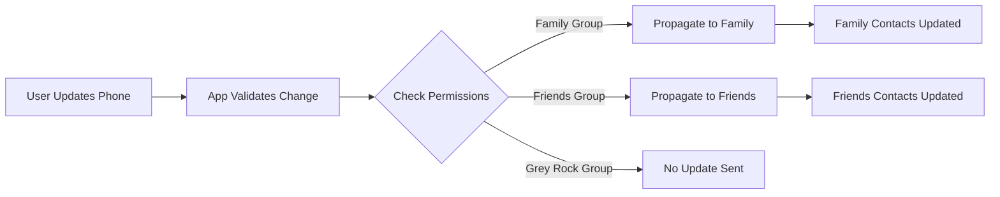
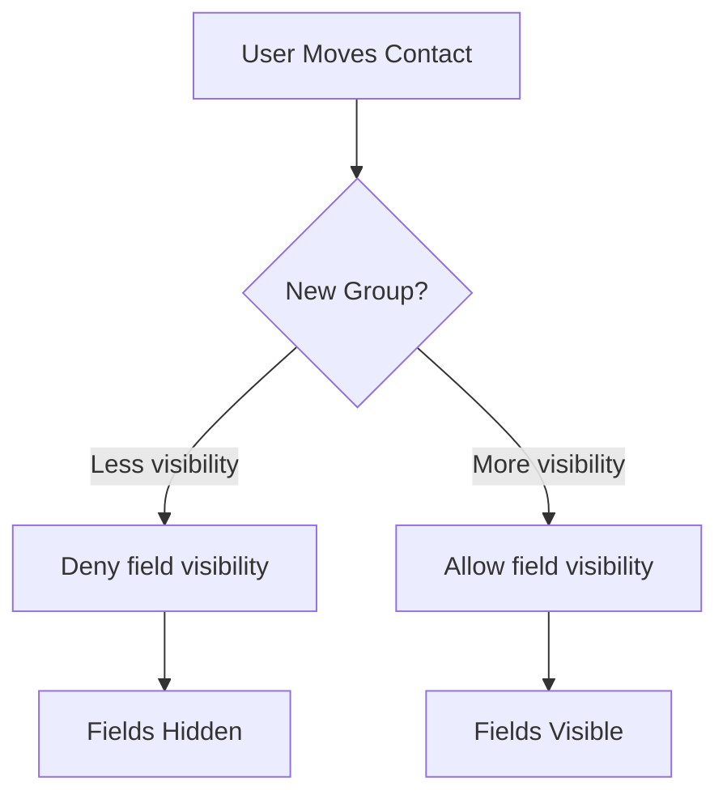

# Gevulot

A consent-based contacts game.

## Overview

Gevulot is a consent-based game for contact management. When you join, you claim _yourself_: you gain exclusive control over your own contact card. In exchange, you relinquish the ability to manually edit other players' information. Everyone plays by the same rule—each person owns their own data, and all participants automatically receive verified updates.

Contacts are placed into groups with visibility presets. **Close friends** may see rich data; **family** something different; **gray rock** sees almost nothing. Changes propagate automatically. The result is a shared, self-updating contact graph where accuracy replaces manual curation, and control is exercised through boundaries.

## Rules

- Each person owns and edits **only their own contact card**
- If you join the game, you accept the rules
- If you don't accept the rules, you don't get to play

## Principles

- Consent > privacy
- Defaults are restrictive
- Participation is voluntary but conditional

## Self-Owned Contact Card

When a user installs the app:

1. App asks: "Who are you?"
2. OS already knows (Me Card / Profile)
3. User claims their identity
4. A **stable user ID** is created (app-level, not OS-level)
5. Only the owner can edit their card

Other users:

- Subscribe to this card
- Receive updates automatically
- Cannot edit it

This eliminates:

- Manual contact maintenance
- Duplicate drift
- Third-party guessing

## Automatic Propagation

When a user updates any field (phone, email, address, social links, websites, metadata), all participants with consent automatically receive updates. No manual sync, no conflicts.

## Groups as Permission Sets

Contacts are placed into groups (Close Friends, Family, Friends, Work, Grey Rock). Each group defines which fields are visible, hidden, or propagate.

When moved to **Grey Rock**, some field visibility is revoked.

## Field-Level Permissions

Each field declares visibility rules (e.g., Phone → Family + Close Friends, Email → Work + Friends, Address → Family only). Permissions are declarative, enforced by the app, and part of the game rules.

## Open Questions / Future Work

- Best UX for identity claiming without spam
- How aggressive auto-merge should be
- How to represent revocation cleanly
- Migration path to decentralization
- Legal framing: consent vs liability

---

> 🤖
>
> [CHANGELOG](docs/CHANGELOG.md) - What we did
> [ROADMAP](docs/ROADMAP.md) - What we wanna do
> [CONTRIBUTING](docs/CONTRIBUTING.md) - How we do it
> [CHECKS](docs/CHECKS.md) - What we accept
>
> [/whatsup](.github/prompts/whatsup.prompt.md) - The prompt that keeps us sane
>
> 🤖
