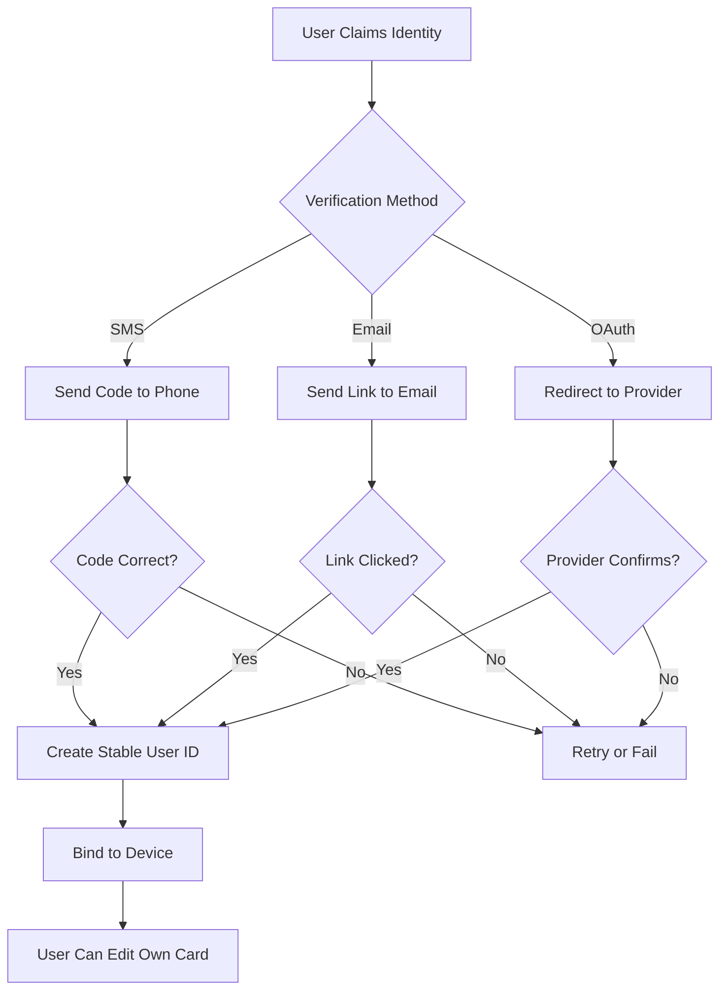

# Gevulot

A consent-based contacts game.

## Overview

Gevulot is a consent-based game for contact management. When you join, you claim _yourself_: you gain exclusive control over your own contact card. In exchange, you relinquish the ability to manually edit other players' information. Everyone plays by the same rule—each person owns their own data, and all participants automatically receive verified updates.

Contacts are placed into groups with visibility presets. **Close friends** may see rich data; **family** something different; **gray rock** sees almost nothing. Changes propagate automatically. The result is a shared, self-updating contact graph where accuracy replaces manual curation, and control is exercised through boundaries.

## Rules

- Each person owns and edits **only their own contact card**
- If you join the game, you accept the rules
- If you don't accept the rules, you don't get to play

## Principles

- Consent > privacy
- Defaults are restrictive
- Participation is voluntary but conditional

## Self-Owned Contact Card

When a user installs the app:

1. App asks: "Who are you?"
2. OS already knows (Me Card / Profile)
3. User claims their identity
4. A **stable user ID** is created (app-level, not OS-level)
5. Only the owner can edit their card

Other users:

- Subscribe to this card
- Receive updates automatically
- Cannot edit it

This eliminates:

- Manual contact maintenance
- Duplicate drift
- Third-party guessing

## Automatic Propagation

When a user updates any field (phone, email, address, social links, websites, metadata), all participants with consent automatically receive updates. No manual sync, no conflicts.

## Groups as Permission Sets

Contacts are placed into groups (Close Friends, Family, Friends, Work, Grey Rock). Each group defines which fields are visible, hidden, or propagate.

When moved to **Grey Rock**, some field visibility is revoked.

## Field-Level Permissions

Each field declares visibility rules (e.g., Phone → Family + Close Friends, Email → Work + Friends, Address → Family only). Permissions are declarative, enforced by the app, and part of the game rules.

## Third-Party / Friend-of-Friend (Future)

Potential feature: "Any friend of Nicholas can see X" with conservative defaults, opt-in only.

## Cryptographic Consent (Optional)

Future option: cryptographic signatures for permissions. Visibility becomes a signed capability with explicit consent trail.

## iOS vs Android — Contact Permissions

### Android

Single permission (`READ_CONTACTS` / `WRITE_CONTACTS`) grants full read/edit/create access. Coarse-grained but powerful.

### iOS

More restrictive. Permissions are explicit and revocable. App must break if permissions are denied. Game rule: if you don't grant permissions, you can't play.

## Accounts & Sync Reality

Contacts may live in Google accounts. iOS aggregates sources. When permission is granted, app sees the unified address book. Google will observe changes—acceptable because the user already consented to Google. This system is about consent, not secrecy.

## Identity Claiming

Problem:

- Multiple people may have multiple contacts representing "you"
- No central authority today

Constraints:

- You do NOT want:
  - Manual back-and-forth confirmations
  - Asking permission per contact
  - Zig-zag workflows

Desired behavior:

- System cleans this automatically

Direction:

- User claims identity once
- App-level ID maps to multiple legacy contact entries
- Over time:
  - Duplicates collapse
  - Canonical card dominates
  - Old entries become inert or deprecated

## Proof of Ownership

When you claim your identity, you must prove ownership per device. This prevents identity hijacking and Sybil attacks.

**Verification Methods:**

1. **SMS Verification** (Primary)
   - Claim phone number → receive SMS code
   - Proves you control that number
   - Standard in banking, Signal, WhatsApp

2. **Email Verification** (Work Contacts)
   - Claim email → receive verification link
   - Domain verification for corporate emails
   - Proves organizational affiliation

3. **OAuth Providers** (Optional)
   - Google/Apple/Microsoft sign-in
   - Leverages existing trust anchor
   - User consents to identity assertion

4. **Device Binding**
   - First claim on device creates binding
   - Subsequent devices require re-verification
   - Prevents mass account creation

**Trust Model:**

**Security Properties:**

- **One identity per phone/email**: Rate limiting prevents Sybil attacks
- **Device fingerprinting**: Detects mass account creation from single device
- **Temporal analysis**: Creating many accounts rapidly = suspicious
- **TOFU (Trust On First Use)**: First claimer wins, subsequent claims require conflict resolution

**Conflict Resolution:**

If two people claim the same identity:

1. Both receive notification
2. Mutual contacts can "vote" for the real person
3. Majority vote wins (weighted by social graph centrality)
4. Loser can appeal or provide additional verification

## Architecture: Centralized → Distributed

**Initial:** Centralized backend for faster iteration and easier debugging.

**Future:** Distributed social graph inspired by Secure Scuttlebutt. Encrypted payloads, everyone acts as relay, only intended recipients decrypt.

## App Development Stack

Cross-platform: React Native or Flutter. VS Code for development, Xcode for iOS builds/signing/TestFlight, Android Studio only for final packaging.

## Distribution & Risk

iOS requires Apple Developer Account, app review, TestFlight for beta.

**Reality check:** App can delete or rewrite contacts. This is dangerous. Must be explicitly communicated as part of the game rules and accepted knowingly.

## Social Incentive

"I only exchange contacts with people who play this game"—similar to Signal-only communication or closed networks. Creates viral incentive, consent-based social pressure, and cleaner graphs over time.

---

## Open Questions / Future Work

- Best UX for identity claiming without spam
- How aggressive auto-merge should be
- How to represent revocation cleanly
- Migration path to decentralization
- Legal framing: consent vs liability
