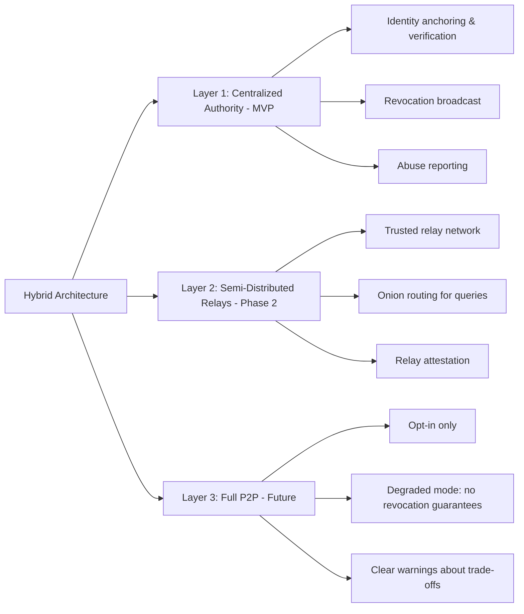
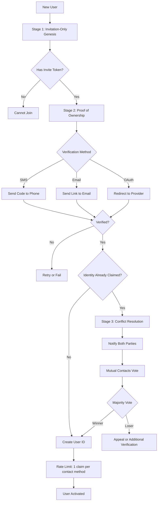
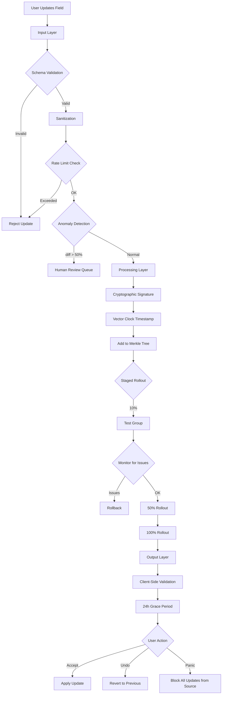
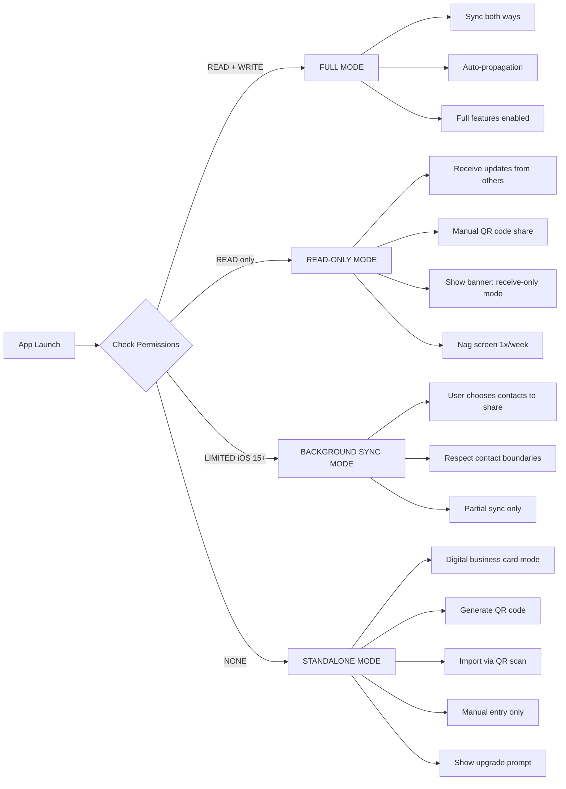
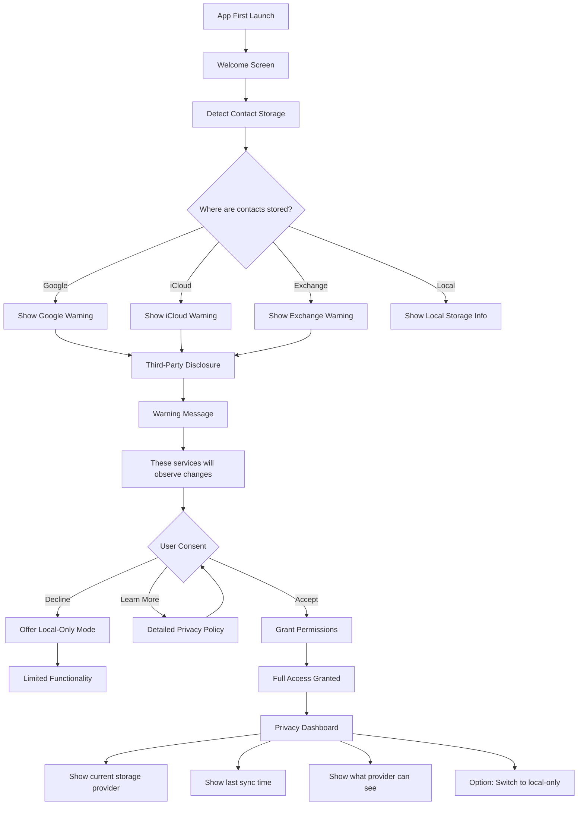
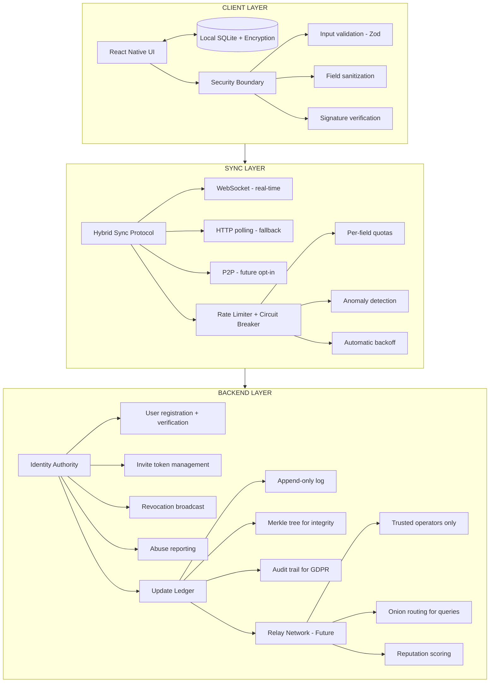

# Gevulot: Product Architecture Analysis

Based on product architecture literature from personal library (Martin Kleppmann - "Designing Data-Intensive Applications")

Cross-referenced with [README.md](../README.md) and [cybersecurity analysis.md](cybersecurity%20analysis.md)

---

> 🤖
>
> - [README](../README.md) - What is Gevulot
> - [CHANGELOG](CHANGELOG.md) - What we did
> - [ROADMAP](ROADMAP.md) - What we wanna do
> - [CONTRIBUTING](CONTRIBUTING.md) - How we do it
> - [CHECKS](CHECKS.md) - What we accept
> - [/whatsup](../.github/prompts/whatsup.prompt.md) - The prompt that keeps us sane
>
> 🤖

---

## Executive Summary

Gevulot's architecture presents a **classic distributed systems migration challenge**: starting centralized for MVP speed, then evolving to peer-to-peer for resilience and autonomy. This analysis examines the architectural decisions through the lens of data-intensive application design, focusing on:

1. **Multi-leader replication patterns** (each device = datacenter)
2. **Offline-first architecture** (contacts sync like calendar apps)
3. **Conflict resolution strategies** (write conflicts are inevitable)
4. **Scalability vs. maintainability trade-offs**

**Key finding:** Gevulot's "centralized → distributed" roadmap mirrors real-world mobile app evolution (e.g., calendar sync implementations), but requires **explicit conflict resolution strategy** before MVP launch.

---

## Current Architecture: Centralized MVP

### From README.md

```
Initial: Centralized backend for faster iteration and easier debugging.
```

This is **architecturally sound** per Kleppmann. The three pillars of data systems are **reliability, scalability, and maintainability**. Centralized architecture maximizes:

- **🛠️ Operability:** "Good operations can often work around limitations of bad software, but good software cannot run reliably with bad operations." Centralized backend = easier monitoring, debugging, deployment.
- **🔬 Simplicity:** "One of the best tools for removing accidental complexity is abstraction." Central server abstracts away distributed consensus problems during MVP.
- **🔄 Plasticity:** "Requirements change constantly." Centralized allows rapid iteration without coordinating device upgrades.

**Trade-off:** Single point of failure, but acceptable for MVP validation.

---

## Target Architecture: Distributed P2P (SSB-Inspired)

### From README.md

```
Future: Each device has local database (offline-first)
Eventually: SSB-style distributed network
```

This is where **multi-leader replication** becomes critical 2️⃣. Kleppmann warns:

> "Multi-leader replication is a somewhat dangerous territory... it is a tricky thing to get right."

### The Core Challenge: Every Device = Datacenter

From Kleppmann's "Offline operation" use case:

> "In this case, **every device has a local database that acts as a leader** (it accepts writes), and there is an asynchronous multi-leader replication process (sync) between the replicas of your calendar on all of your devices. The replication lag may be hours or days, depending on when you next have internet access available."

**Gevulot's scenario:** Contact data sync across user's devices + propagation to contacts' devices = **multi-datacenter replication** where each device is a "datacenter" with extremely unreliable network connections.

**Historical precedent:**

> "CouchDB is designed for this mode of operation. There are also calendar apps like Google Calendar and Evernote that work in this way. However, there is a rich history of **broken calendar sync implementations** that demonstrate that multi-master replication is a tricky thing to get right."

⚠️ **Warning:** Contacts are MORE complex than calendar events (relationships, permissions, deletions must sync correctly).
**Headache:**

- You lose control of propagation after initial dissemination
- Malicious relays can log who requests decrypt of which contact (traffic analysis)
- Revocation in distributed systems is **fundamentally difficult**—can't "undo" a relay

**Elegant Solution:**



**Specific hardening:**

- **Mix networks** instead of direct relay 2️⃣ (hides traffic patterns)
- **Timestamped revocation tokens** that propagate via gossip protocol
- **Relay reputation system** based on who invites whom

---

#### **2. Identity Claiming = Race Condition + Sybil Attack**

**Problem:** "User claims identity once" without proof of ownership 3️⃣
**Headache:**

- First-come-first-served → someone can claim YOUR identity before you
- Nothing prevents 1 person from creating 1000 identities (Sybil attack)
- Auto-merge of duplicates can be exploited for poisoning

**Elegant Solution:**



**Specific hardening:**

- **Web of Trust score** 4️⃣: new users need N endorsements
- **Device fingerprinting** to detect mass account creation
- **Temporal analysis**: creating 50 accounts in 1 hour = red flag

---

#### **3. Automatic Propagation = Data Integrity Nightmare**

**Problem:** "All participants automatically receive updates" 5️⃣
**Headache:**

- No rate limiting → attacker can spam updates 1000x/second
- No validation → can propagate malicious field (XSS in "Name")
- No rollback → if something goes wrong, damage has already propagated

**Elegant Solution:**



**Specific hardening:**

- **Update signatures** with timestamp + nonce (prevent replay attacks) 6️⃣
- **Field-level checksums** to detect corruption
- **Gossip anti-entropy** for eventual consistency

---

#### **4. Permission Revocation = App Crash Risk**

**Problem:** iOS allows users to revoke permissions AT ANY TIME 7️⃣
**Headache:**

- App crashes if it assumes permissions are always granted
- Bad App Store reviews = potential rejection
- Need graceful handling of permission state changes
- Game rules require permissions, but iOS doesn't guarantee persistence

**Elegant Solution:**



**Specific hardening:**

- **Jailed sandbox mode** 8️⃣ when permissions denied (not coercion, just game rules)
- **Clear state machine** for each permission level
- **Telemetry** to measure what % remain in each mode
- **Upfront disclosure**: "This game requires contact access to play. It's a rule, like multiplayer requiring internet."

---

#### **5. Google Observes Everything = GDPR Landmine**

**Problem:** "Acceptable because user consented to Google" 9️⃣
**Headache:**

- Consent for Google Contacts ≠ consent for Gevulot syncing via Google
- GDPR Article 7: consent must be **specific, informed, unambiguous**
- You are **data controller** if processing data via Google APIs

**Elegant Solution:**



**Specific hardening:**

- **Separate consent checkbox** for third-party observation
- **Privacy policy generator** based on which services user uses
- **Local-first option** that never touches Google APIs

---

### 💎 **PROPOSED ELEGANT ARCHITECTURE**

Based on cybersecurity literature, here's a hardened architecture:



---

### 🛡️ **HARDENING CHECKLIST**

**Immediate (before MVP launch):**

- [ ] Input validation with schema (Zod)
- [ ] Rate limiting per field
- [ ] Graceful degradation for permissions
- [ ] SMS/Email verification for identity claiming
- [ ] Separate consent disclosure for third-party observation
- [ ] Automatic backup before bulk operations
- [ ] Panic button ("stop syncing with X")

**Phase 2 (before distribution):**

- [ ] Cryptographic signatures on updates
- [ ] Append-only audit log
- [ ] Revocation tokens with TTL
- [ ] Invite-only expansion
- [ ] Abuse reporting system
- [ ] Local-first mode (no Google sync)

**Future (distributed mode):**

- [ ] Mix network for relay queries
- [ ] Web of Trust scoring
- [ ] Onion routing
- [ ] Zero-knowledge proofs for "friend of friend"
- [ ] Homomorphic encryption for server-side operations

---

### Sources (from previous analysis)

1️⃣ [Threat modeling fundamentals.epub](../personal%20library/books/cybersecurity/Threat%20modeling%20fundamentals.epub)

    creating decentralized networks helps mitigate

2️⃣ [Beyond Fear.epub](../personal%20library/books/cybersecurity/Beyond%20Fear.epub)

    hiding 209 210 212

3️⃣ [Secrets and Lies.epub](../personal%20library/books/cybersecurity/Secrets%20and%20Lies.epub)

    identification and authentication measures have

4️⃣ [Liars and Outliers.epub](../personal%20library/books/cybersecurity/Liars%20and%20Outliers.epub)

    Reputational Pressures 87

5️⃣ [Beyond Fear.epub](../personal%20library/books/cybersecurity/Beyond%20Fear.epub)

    automatic propagation update synchronization

6️⃣ [Secrets and Lies.epub](../personal%20library/books/cybersecurity/Secrets%20and%20Lies.epub)

    cryptographic signature de cada

7️⃣ [Schneier on Security.epub](../personal%20library/books/cybersecurity/Schneier%20on%20Security.epub)

    police officer who demands to

8️⃣ [Security Engineering.epub](../personal%20library/books/cybersecurity_strategy/Security%20Engineering.epub)

    jailed sandbox mode graceful

9️⃣ [The Age of Surveillance Capitalism.epub](../personal%20library/books/cybersecurity/The%20Age%20of%20Surveillance%20Capitalism.epub)

    Consent Under the GDPR

---

## Additional Security Considerations

### Threat Model

**Assets to protect:**

- User identity credentials
- Contact information (PII)
- Social graph topology
- Update history

**Adversaries:**

- Malicious users (stalkers, abusers)
- Data brokers
- State-level actors
- Compromised relays (in distributed mode)

**Attack vectors:**

- Identity hijacking
- Mass data harvesting
- Traffic analysis
- Sybil attacks
- Replay attacks
- XSS/injection attacks

### Defense in Depth

Apply multiple security layers:

1. **Client-side**: Input validation, sanitization, encryption at rest
2. **Network**: TLS, certificate pinning, rate limiting
3. **Server-side**: Authentication, authorization, audit logging
4. **Application**: Permission model, revocation system, abuse reporting
5. **Social**: Invite-only growth, reputation scoring, community moderation

### Privacy by Design

- **Data minimization**: Only collect necessary fields
- **Purpose limitation**: Use data only for stated purpose
- **Storage limitation**: Delete after N months of inactivity
- **Accuracy**: Allow users to correct their data
- **Integrity**: Cryptographic signatures prevent tampering
- **Confidentiality**: Encryption in transit and at rest
- **Availability**: Graceful degradation when services fail

### Compliance Considerations

**GDPR (if EU users):**

- Right to access (export all data)
- Right to rectification (edit contact card)
- Right to erasure ("forget me" button)
- Right to portability (standard JSON export)
- Right to object (opt-out of specific processing)
- Data breach notification (within 72h)

**CCPA (if California users):**

- Disclosure of data collection practices
- Right to know what data is collected
- Right to delete personal information
- Right to opt-out of data sale (not applicable if no selling)

**App Store requirements:**

- Privacy nutrition labels
- Clear permission requests
- No unexpected data collection
- User control over data

---

**Next Steps:**

1. Create detailed technical specs for each hardening point
2. Set up security testing framework (fuzzing, penetration testing)
3. Implement monitoring and alerting for anomalies
4. Develop incident response plan
5. Regular security audits and code reviews
