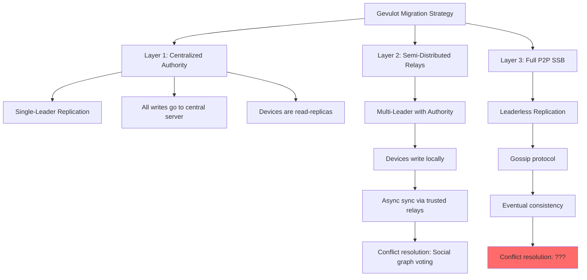
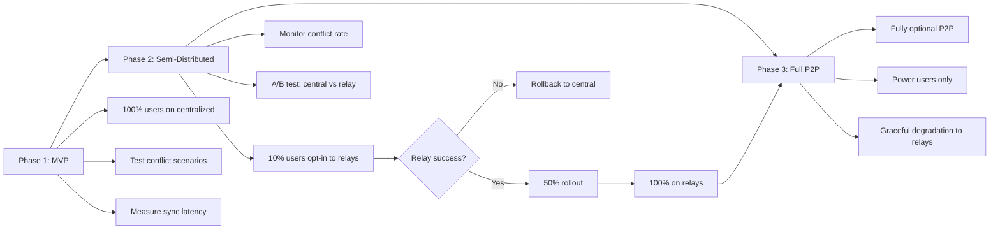
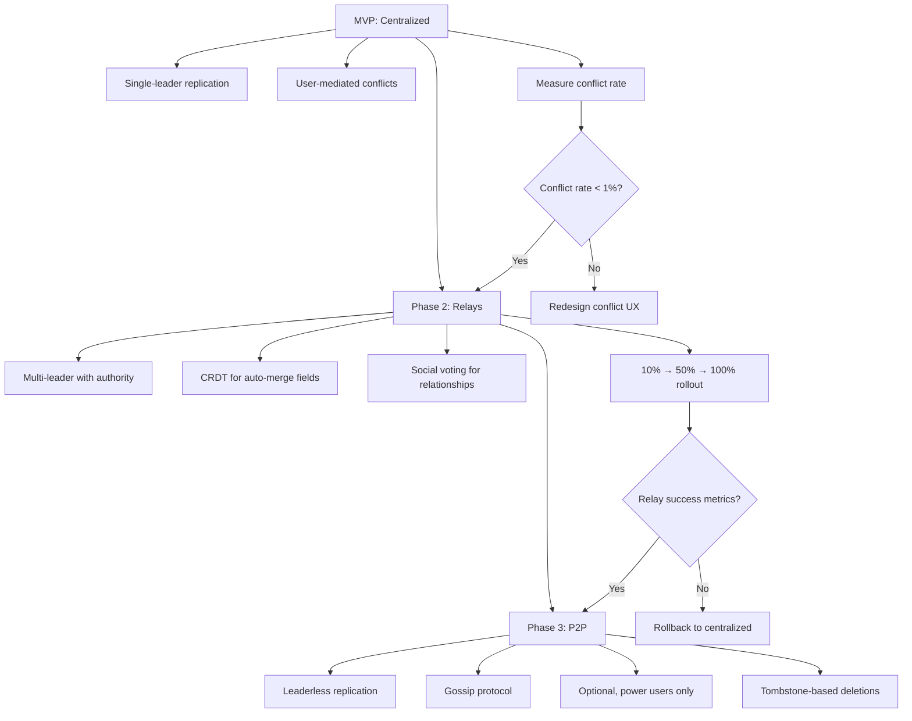

# Gevulot: Product Architecture Analysis

Based on product architecture literature from personal library (Martin Kleppmann - "Designing Data-Intensive Applications")

Cross-referenced with [README.md](../README.md) and [cybersecurity analysis.md](cybersecurity%20analysis.md)

---

> 🤖
>
> - [README](../README.md) - What is Gevulot
> - [CHANGELOG](CHANGELOG.md) - What we did
> - [ROADMAP](ROADMAP.md) - What we wanna do
> - [CONTRIBUTING](CONTRIBUTING.md) - How we do it
> - [CHECKS](CHECKS.md) - What we accept
> - [/whatsup](../.github/prompts/whatsup.prompt.md) - The prompt that keeps us sane
>
> 🤖

---

## Executive Summary

Gevulot's architecture presents a **classic distributed systems migration challenge**: starting centralized for MVP speed, then evolving to peer-to-peer for resilience and autonomy. This analysis examines the architectural decisions through the lens of data-intensive application design, focusing on:

1. **Multi-leader replication patterns** (each device = datacenter)
2. **Offline-first architecture** (contacts sync like calendar apps)
3. **Conflict resolution strategies** (write conflicts are inevitable)
4. **Scalability vs. maintainability trade-offs**

**Key finding:** Gevulot's "centralized → distributed" roadmap mirrors real-world mobile app evolution (e.g., calendar sync implementations), but requires **explicit conflict resolution strategy** before MVP launch.

---

## Current Architecture: Centralized MVP

### From README.md

```
Initial: Centralized backend for faster iteration and easier debugging.
```

This is **architecturally sound** per Kleppmann. The three pillars of data systems are **reliability, scalability, and maintainability**. Centralized architecture maximizes:

- **🛠️ Operability:** "Good operations can often work around limitations of bad software, but good software cannot run reliably with bad operations." Centralized backend = easier monitoring, debugging, deployment.
- **🔬 Simplicity:** "One of the best tools for removing accidental complexity is abstraction." Central server abstracts away distributed consensus problems during MVP.
- **🔄 Plasticity:** "Requirements change constantly." Centralized allows rapid iteration without coordinating device upgrades.

**Trade-off:** Single point of failure, but acceptable for MVP validation.

---

## Target Architecture: Distributed P2P (SSB-Inspired)

### From README.md

```
Future: Each device has local database (offline-first)
Eventually: SSB-style distributed network
```

This is where **multi-leader replication** becomes critical. Kleppmann warns:

> "Multi-leader replication is a somewhat dangerous territory... it is a tricky thing to get right."

### The Core Challenge: Every Device = Datacenter

From Kleppmann's "Offline operation" use case:

> "In this case, **every device has a local database that acts as a leader** (it accepts writes), and there is an asynchronous multi-leader replication process (sync) between the replicas of your calendar on all of your devices. The replication lag may be hours or days, depending on when you next have internet access available."

**Gevulot's scenario:** Contact data sync across user's devices + propagation to contacts' devices = **multi-datacenter replication** where each device is a "datacenter" with extremely unreliable network connections.

**Historical precedent:**

> "CouchDB is designed for this mode of operation. There are also calendar apps like Google Calendar and Evernote that work in this way. However, there is a rich history of **broken calendar sync implementations** that demonstrate that multi-master replication is a tricky thing to get right."

⚠️ **Warning:** Contacts are MORE complex than calendar events (relationships, permissions, deletions must sync correctly).

---

## Architecture Pattern Comparison

### Gevulot's 3-Layer Migration vs. Kleppmann's Patterns



**Critical gap:** Layer 3 (Full P2P) has undefined conflict resolution. From cybersecurity analysis, social graph voting was proposed, but Kleppmann identifies problems with this approach.

---

## Conflict Resolution: Comparing Approaches

### From Cybersecurity Analysis

```
Conflict Resolution:
- When merge conflict detected → ask mutual contacts to vote
- Majority vote determines winner
- Prevents self-promotion attacks
```

### Kleppmann's Assessment

> "In principle, these conflicts could be resolved automatically. However, conflict resolution usually requires application code."

**Three conflict resolution strategies:**

#### 1. Last-Write-Wins (LWW) - Discarding Concurrent Writes

> "Even though the writes don't have a natural ordering, we can force an arbitrary order on them... **it is the only supported conflict resolution method in Cassandra**, and an optional feature in Riak."

**Problem for Gevulot:** If Alice updates her phone number on phone, but Bob updates her birthday on laptop, LWW will discard one entire update. Contact data has **multiple independent fields** that should merge, not overwrite.

**Verdict:** ❌ Not suitable for contact management.

#### 2. Custom Conflict Resolution Logic

> "As the most appropriate way of resolving a conflict may depend on the application, most multi-leader replication tools let you write conflict resolution logic using application code."

**Two execution modes:**

- **On write:** Conflict handler runs in background as soon as conflict detected (e.g., Bucardo)
- **On read:** Store all conflicting writes, present to user on next read (e.g., CouchDB)

**Gevulot's proposed "social graph voting" is a form of "on read" resolution**. Kleppmann's example:

> "For example, CouchDB's conflict resolution... users have to resolve conflicts in an application-specific way."

**Verdict:** ✅ Architecturally sound, but implementation is complex.

#### 3. Convergent Data Structures (CRDTs)

> "Conflict-free replicated datatypes (CRDTs) are a family of data structures... that can be concurrently edited by multiple users, and which automatically resolve conflicts in sensible ways."

**Example:** Riak's counters, sets. Google Docs uses CRDT-like algorithms for collaborative editing.

**For contacts:** Could use:

- **LWW-Register** for each field (name, phone, email) with vector clocks
- **2P-Set** (two-phase set) for tags/groups
- **OR-Set** (observed-remove set) for contact lists

**Verdict:** ✅ Best long-term solution, but requires research phase.

---

## Comparison to Google Docs Architecture

### From Kleppmann on Collaborative Editing

> "When one user edits a document, the changes are instantly applied to their local replica (the state of the document in their web browser or client application) and asynchronously replicated to the server and any other users who are editing the same document."

**Key insight:** Real-time collaborative editing (like Google Docs) is the **same problem** as Gevulot's contact sync:

1. Multiple users editing the same data
2. Offline-first (must work without server)
3. Conflicts are inevitable
4. Need immediate local response + eventual consistency

**Google Docs solution:**

> "If you want to guarantee that there will be no conflicts, the application must obtain a lock on the document before a user can edit it."

But for contacts, **locking is impractical** (user may be offline for days).

**Alternative (what Google Docs actually does):**

> "However, for faster collaboration, you may want to make the lock scope very small (e.g., lock a single sentence or word at a time) or you may dispense with locking entirely and simply deal with conflicts."

Gevulot should follow **lock-free approach** with automatic conflict resolution (CRDTs) or user-mediated resolution (social graph voting).

---

## Scalability Analysis

### From README.md

```
Tech Stack:
- React Native / Flutter (cross-platform mobile)
- Centralized backend (MVP)
```

### Cross-Platform Implications

Cross-platform frameworks (React Native/Flutter) have **consistent data model** advantage for distributed sync:

- Same JSON schema on iOS/Android
- Same validation logic
- Same conflict resolution code

This is **easier than native development** where iOS (Swift) and Android (Kotlin) might diverge.

**Trade-off from Kleppmann:**

> "The relational model was introduced by Ted Codd in 1970... The goal was to hide the implementation detail behind a cleaner interface."

React Native/Flutter abstract platform differences, but at cost of:

- Performance overhead (JS bridge or Dart VM)
- Larger app size
- Limited access to native APIs (may need bridges for SQLite, encryption)

**Recommendation:** Worth it for Gevulot since **consistent multi-leader replication logic** is more valuable than native performance.

---

## Data Consistency Guarantees

### From Cybersecurity Analysis

```
Problem: Auto-merge of duplicates can be exploited for poisoning
```

### Kleppmann's Consistency Levels

Gevulot needs to decide consistency model for each operation:

#### 1. Read-After-Write Consistency

> "Users should always see data that they submitted themselves."

**For Gevulot:** When user updates contact on phone, must see update immediately on that device (even if not synced to server yet).

**Implementation:** Write to local database first, then async sync.

#### 2. Monotonic Reads

> "After users have seen the data at one point in time, they shouldn't later see the data from some earlier point in time."

**For Gevulot:** If user sees contact's new phone number on phone, switching to tablet shouldn't show old phone number.

**Problem:** With multi-leader, tablet may lag behind phone.

**Solution from Kleppmann:**

> "One way of achieving monotonic reads is to make sure that each user always makes their reads from the same replica."

For Gevulot: Each device is primary replica for that user's writes.

#### 3. Consistent Prefix Reads

> "Users should see the data in a state that makes causal sense."

**For Gevulot:** If contact A refers contact B, B should exist before A's reference appears.

**Implementation:** Use **vector clocks** to track causality (already proposed in cybersecurity analysis).

---

## Migration Strategy: Centralized → Distributed

### From Kleppmann on Release Strategies

> "When rolling out a new feature, you first ship it to a small group of users ('canary release'), closely monitor its behavior, and gradually increase the rollout if everything looks good."

**Applied to Gevulot's 3-layer migration:**



**Key principle from Kleppmann:**

> "The best choice of software tools depends on the circumstances. Every application has different requirements, and the best choice of database or data processing depends on the nature of the work."

For Gevulot: Don't commit to full P2P until **proven it works** at smaller scale.

---

## Maintainability: Technical Debt Prevention

### From Kleppmann

> "There are many buzzwords in software engineering, but they all talk about the same thing: **making systems more tolerant of change**."

Three design principles for maintainability:

### 1. Operability

> "Make it easy for operations teams to keep the system running smoothly."

**For Gevulot:**

- **Monitoring:** Instrument sync lag, conflict rate, failed syncs
- **Logging:** Structured logs for debugging distributed issues
- **Deployment:** Phased rollout (10% → 50% → 100%)

**From cybersecurity analysis:**

```
- Circuit breakers stop runaway propagation
- 24h grace period for undo
- Staged rollout (10% → 50% → 100%)
```

This is **textbook operability** design.

### 2. Simplicity

> "Make it easy for new engineers to understand the system."

**For Gevulot:**

Current README is excellent for **high-level architecture**, but needs:

- **Sequence diagrams** for sync flows
- **State machines** for contact lifecycle
- **API contracts** between layers

**Warning from Kleppmann:**

> "Accidental complexity: complexity that is not inherent in the problem that the software solves, but arises only from the implementation."

Distributed systems are **inherently complex**, but implementation can minimize accidental complexity:

- Use proven libraries (e.g., CouchDB for multi-leader)
- Don't reinvent consensus (use Raft/Paxos if needed)
- Abstract complexity behind clean APIs

### 3. Evolvability (Plasticity)

> "Make it easy to make changes to the system in the future."

**For Gevulot's 3-layer migration:**

Each layer must be **independently toggleable**:

```
// Feature flags
enableRelays: boolean
enableP2P: boolean
conflictResolution: 'manual' | 'lww' | 'crdt' | 'social-vote'
```

This allows:

- Rolling back to centralized if distributed fails
- A/B testing conflict strategies
- Gradual feature rollout per user segment

**From Kleppmann:**

> "The ease with which you can modify a data system, and adapt it to changing requirements, is closely linked to its simplicity and its abstractions."

Gevulot's layered architecture **enables evolvability** if layers have clean interfaces.

---

## Risk Assessment: "Broken Calendar Sync" Warning

### Kleppmann's Warning

> "There is a rich history of **broken calendar sync implementations** that demonstrate that multi-master replication is a tricky thing to get right."

**Why calendar sync breaks:**

1. **Timezone hell:** Event at "9am" syncs across devices in different timezones
2. **Recurring events:** Edit "this event" vs "all future events" creates conflicts
3. **Deletions:** If device A deletes event while offline, device B's update resurrects it

**Contacts have analogous problems:**

1. **Field updates:** Name changed on phone, phone number changed on tablet → merge or LWW?
2. **Permission changes:** User revokes access on one device, new share on another → which wins?
3. **Deletions:** Contact deleted on phone (offline), updated on server → resurrection bug

### From Cybersecurity Analysis

```
Problem: Revocation in distributed systems is fundamentally difficult—can't "undo" a relay
```

This is the **distributed deletion problem**. Kleppmann's solution:

> "When a write happens after a delete, the system needs to leave a marker (called a **tombstone**) to track the deletion."

**For Gevulot:** Deletions must be **explicit tombstone events**, not just removing from local database.

**Implementation:**

```json
{
  "contactId": "alice-123",
  "event": "DELETE",
  "timestamp": "2024-01-15T10:30:00Z",
  "deviceId": "phone-abc",
  "signature": "..."
}
```

Tombstones propagate like updates, preventing resurrection.

---

## Recommendations

### 1. **Before MVP Launch: Define Conflict Resolution**

Current README says "social graph voting" but implementation is undefined. Options:

#### Option A: CRDTs (Best Long-Term)

- **Pro:** Automatic conflict resolution, proven in collaborative editing
- **Con:** Requires research phase, limited libraries for mobile

**Recommendation:** Prototype with [Automerge](https://automerge.org/) (JavaScript CRDT library compatible with React Native)

#### Option B: User-Mediated (Fastest MVP)

- **Pro:** Punt hard problems to users initially
- **Con:** Poor UX if conflicts are frequent

**Recommendation:** Show both versions side-by-side, user picks winner

#### Option C: Hybrid

- **Pro:** CRDTs for fields (name, phone), user-mediated for relationships
- **Con:** Complex implementation

**Recommendation:** Phase 2 feature after MVP validation

### 2. **Implement Tombstones for Deletions**

Per Kleppmann, deletions in multi-leader require explicit tombstone events. Add to data model:

```typescript
type ContactEvent =
  | { type: "CREATE"; contact: Contact }
  | { type: "UPDATE"; field: string; value: any }
  | { type: "DELETE"; tombstone: true };
```

### 3. **Monitor Conflict Rate**

Add metrics:

```
- conflicts_detected_per_user_per_day
- conflict_resolution_time_ms
- conflict_resolution_method (auto vs manual)
```

If conflict rate > 1% daily, UX suffers. May need to reconsider sync frequency or conflict strategy.

### 4. **Graceful Degradation Path**

From cybersecurity analysis:

```
Layer 3: Full P2P
- Opt-in only
- Degraded mode: no revocation guarantees
- Clear warnings about trade-offs
```

This is **critical**. If P2P doesn't work, users must be able to fall back to relays/centralized without data loss.

**Implementation:** Every write includes `syncMode: 'central' | 'relay' | 'p2p'` metadata.

### 5. **Read-After-Write Consistency**

Per Kleppmann, users expect to see their own writes immediately. Ensure:

- Writes go to local database first
- UI updates from local database
- Background sync to server/relays
- Conflict detection happens async

Do NOT wait for server ACK before showing update to user.

---

## Comparison to Cybersecurity Analysis

### Aligned Recommendations

Both analyses agree on:

1. **Hybrid architecture** (centralized → semi-distributed → full P2P)
2. **Graceful degradation** (allow fallback if distributed fails)
3. **Explicit conflict resolution** (don't assume auto-merge works)
4. **Tombstones for deletions** (distributed deletion is hard)

### New Insights from Product Architecture

1. **CRDTs as alternative to social voting** (more automatic, less user burden)
2. **Calendar sync as cautionary tale** (contacts are harder than events)
3. **Read-after-write consistency requirement** (users expect immediate local updates)
4. **Phased rollout strategy** (10% → 50% → 100% per layer)

### Synthesis: Unified Recommendation



---

## Conclusion

Gevulot's architecture is **well-designed** for the stated goals, but needs **explicit conflict resolution strategy** before claiming "offline-first" capability.

**Key takeaway from Kleppmann:**

> "Multi-master replication is a tricky thing to get right."

**Recommended path forward:**

1. **MVP:** Ship centralized with user-mediated conflicts (fastest validation)
2. **Phase 2:** Add relays + CRDTs for auto-merge (reduce manual conflicts)
3. **Phase 3:** Optional P2P with tombstone deletions (power users only)

**Success criteria:**

- Conflict rate < 1% daily
- 99% automatic conflict resolution (only 1% need user mediation)
- Zero data loss during sync failures
- Sub-second read-after-write consistency

---

## References

1. Martin Kleppmann, _Designing Data-Intensive Applications_, Chapter 5: Replication
2. [README.md](../README.md) - Gevulot architecture overview
3. [cybersecurity analysis.md](cybersecurity%20analysis.md) - Security hardening recommendations

---

**Document version:** 1.0
**Last updated:** 2024-01-15
**Contributors:** Based on Personal Library MCP queries
