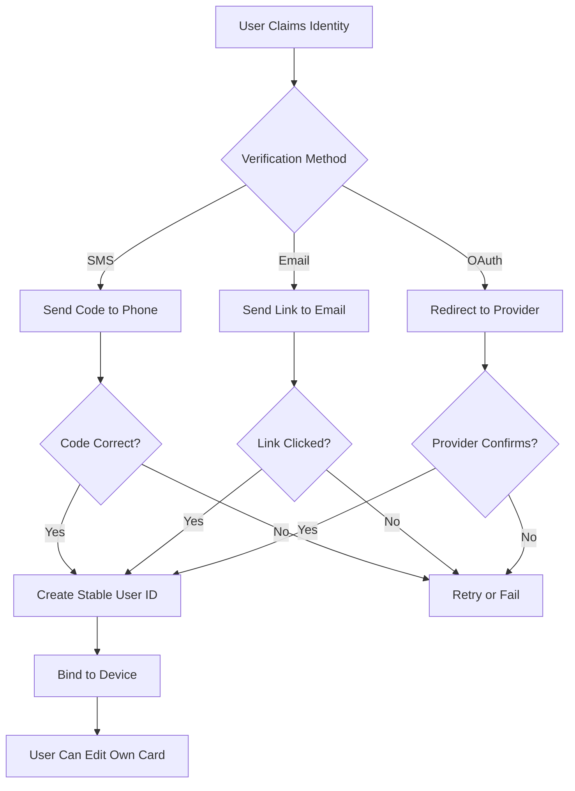

# v0.2.0 - MVP - Core Contact Card

## Identity Claiming

Problem:

- Multiple people may have multiple contacts representing "you"
- No central authority today

Constraints:

- You do NOT want:
  - Manual back-and-forth confirmations
  - Asking permission per contact
  - Zig-zag workflows

Desired behavior:

- System cleans this automatically

Direction:

- User claims identity once
- App-level ID maps to multiple legacy contact entries
- Over time:
  - Duplicates collapse
  - Canonical card dominates
  - Old entries become inert or deprecated

## Proof of Ownership

When you claim your identity, you must prove ownership per device. This prevents identity hijacking and Sybil attacks.

**Verification Methods:**

1. **SMS Verification** (Primary)
   - Claim phone number → receive SMS code
   - Proves you control that number
   - Standard in banking, Signal, WhatsApp

2. **Email Verification** (Work Contacts)
   - Claim email → receive verification link
   - Domain verification for corporate emails
   - Proves organizational affiliation

3. **OAuth Providers** (Optional)
   - Google/Apple/Microsoft sign-in
   - Leverages existing trust anchor
   - User consents to identity assertion

4. **Device Binding**
   - First claim on device creates binding
   - Subsequent devices require re-verification
   - Prevents mass account creation

**Trust Model:**

**Security Properties:**

- **One identity per phone/email**: Rate limiting prevents Sybil attacks
- **Device fingerprinting**: Detects mass account creation from single device
- **Temporal analysis**: Creating many accounts rapidly = suspicious
- **TOFU (Trust On First Use)**: First claimer wins, subsequent claims require conflict resolution

**Conflict Resolution:**

If two people claim the same identity:

1. Both receive notification
2. Mutual contacts can "vote" for the real person
3. Majority vote wins (weighted by social graph centrality)
4. Loser can appeal or provide additional verification
